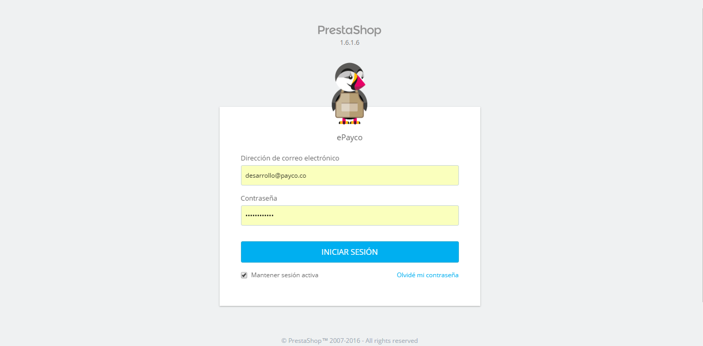
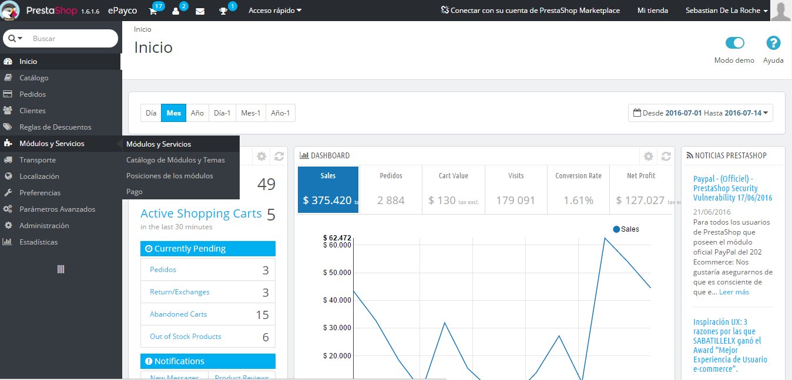
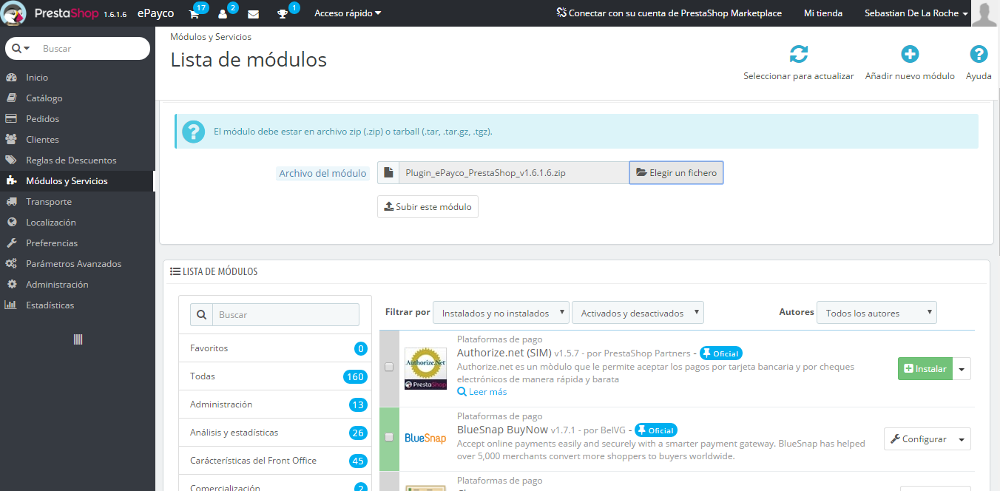
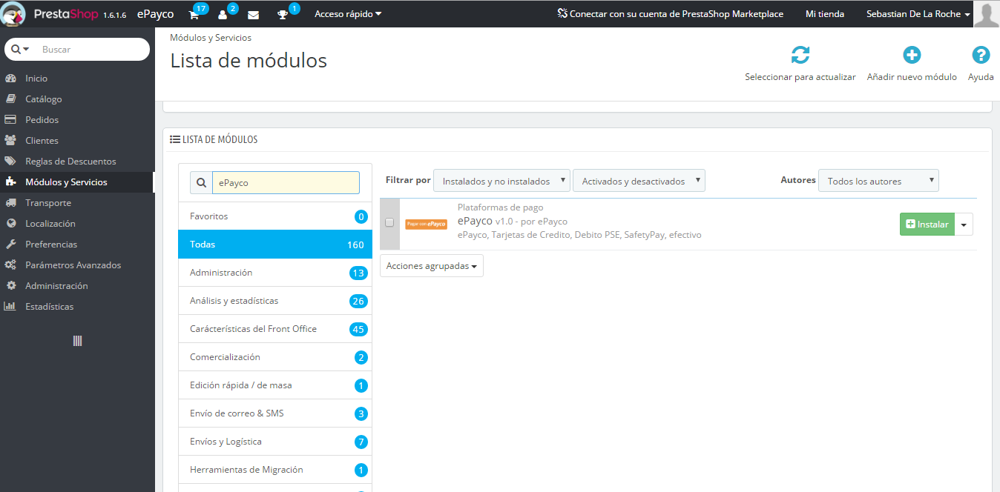
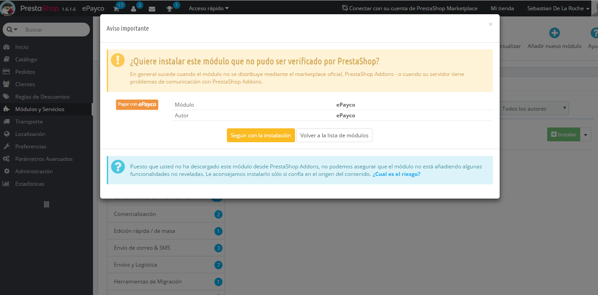
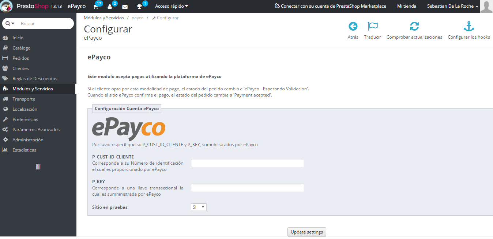
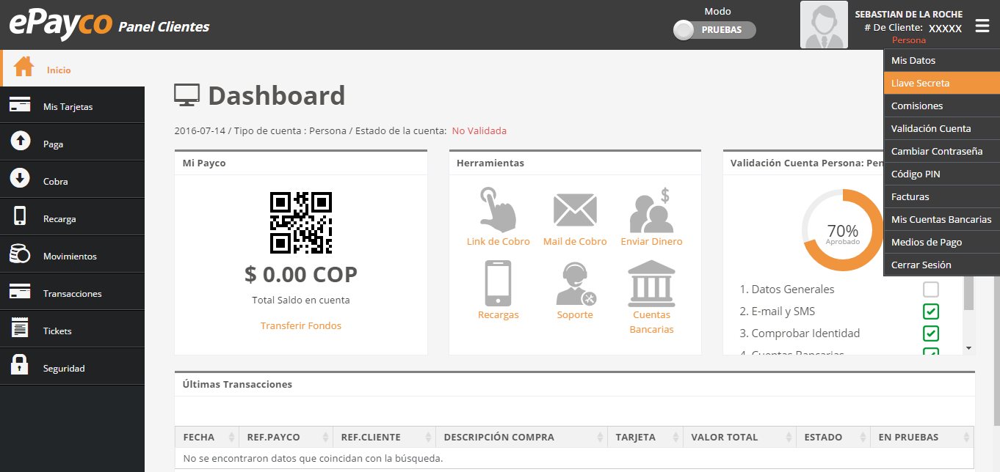

# ePayco plugin para PrestaShop v1.9.5.2

**Si usted tiene alguna pregunta o problema, no dude en ponerse en contacto con nuestro soporte técnico: desarrollo@payco.co.**

## Tabla de contenido

* [Versiones](#versiones)
* [Requisitos](#requisitos)
* [Instalación](#instalación)
* [Pasos](#pasos)

## Versiones
* [ePayco plugin OnPage_Checkout_PrestaShop v1.9.6.0](https://github.com/epayco/Plugin_ePayco_PrestaShop/releases/tag/1.9.6.0)
* [ePayco plugin OnPage_Checkout_PrestaShop v1.9.5.2](https://github.com/epayco/Plugin_ePayco_PrestaShop/releases/tag/1.9.5.2)
* [ePayco plugin OnPage_Checkout_PrestaShop v1.9.5.1](https://github.com/epayco/Plugin_ePayco_PrestaShop/releases/tag/1.9.5.1)
* [ePayco plugin OnPage_Checkout_PrestaShop v1.9.5.0](https://github.com/epayco/Plugin_ePayco_PrestaShop/releases/tag/1.9.5.0)
* [ePayco plugin OnPage_Checkout_PrestaShop v1.9.4.1](https://github.com/epayco/Plugin_ePayco_PrestaShop/releases/tag/1.9.4.1)
* [ePayco plugin OnPage_Checkout_PrestaShop v1.9.4.0](https://github.com/epayco/Plugin_ePayco_PrestaShop/releases/tag/1.9.4.0)
* [ePayco plugin OnPage_Checkout_PrestaShop v1.9.3.0](https://github.com/epayco/Plugin_ePayco_PrestaShop/releases/tag/1.9.3.0)
* [ePayco plugin OnPage_Checkout_PrestaShop v1.9.2.2](https://github.com/epayco/Plugin_ePayco_PrestaShop/releases/tag/1.9.2.2)
* [ePayco plugin OnPage_Checkout_PrestaShop v1.9.1.2](https://github.com/epayco/Plugin_ePayco_PrestaShop/releases/tag/1.9.1.2)
* [ePayco plugin OnPage_Checkout_PrestaShop v1.9.1.1](https://github.com/epayco/Plugin_ePayco_PrestaShop/releases/tag/1.9.1.1)
* [ePayco plugin OnPage_Checkout_PrestaShop v1.9.0.1](https://github.com/epayco/Plugin_ePayco_PrestaShop/releases/tag/1.9.0.1)
* [ePayco plugin OnPage_Checkout_PrestaShop v1.9.0](https://github.com/epayco/Plugin_ePayco_PrestaShop/releases/tag/1.9.0.0)
* [ePayco plugin OnPage_Checkout_PrestaShop v1.8.0](https://github.com/epayco/Plugin_ePayco_PrestaShop/releases/tag/1.8.0.0)
* [ePayco plugin OnPage_Checkout_PrestaShop v1.7.7](https://github.com/epayco/Plugin_ePayco_PrestaShop/releases/tag/1.7.7.x)
* [ePayco plugin OnPage_Checkout_PrestaShop v1.7.6](https://github.com/epayco/Plugin_ePayco_PrestaShop/releases/tag/1.7.6)
* [ePayco plugin OnPage_Checkout_PrestaShop v1.7.5](https://github.com/epayco/Plugin_ePayco_PrestaShop/releases/tag/1.7.5)
* [ePayco plugin OnPage_Checkout_PrestaShop v1.7.4](https://github.com/epayco/Plugin_ePayco_PrestaShop/releases/tag/1.7.4)
* [ePayco plugin OnPage_Checkout_PrestaShop v1.7.3](https://github.com/epayco/Plugin_ePayco_PrestaShop/releases/tag/1.7.3)
* [ePayco plugin OnPage_Checkout_PrestaShop v1.7](https://github.com/epayco/Plugin_ePayco_PrestaShop/releases/tag/1.7)
* [ePayco plugin PrestaShop v1.6.1.6](https://github.com/epayco/Plugin_ePayco_PrestaShop/releases/tag/1.6.1.6)
* [ePayco plugin PrestaShop v1.5.6.2](https://github.com/epayco/Plugin_ePayco_PrestaShop/releases/tag/1.5.6.2)

## Requisitos

* Tener una cuenta activa en [ePayco](https://pagaycobra.com).
* Tener instalado PrestaShop v1.6.1.6 o superior.
* Acceso a las carpetas donde está instalado PrestaShop.
* Acceso al admin de PrestaShop.

## Instalación

1. [Descarga el plugin.](https://github.com/epayco/Plugin_ePayco_PrestaShop/releases/tag/1.9.5.2).
2. Descomprime el archivo que acabas de descargar y luego comprimer la carpeta llamada payco.
3. Ingresa a tu administrador de PrestaShop.
4. Ve a "Módulos o Servicios".
5. Carga el archivo llamado payco en PrestaShop.
6. Busca el plugin ePayco en la lista de módulos.
7. Haz clic en Instalar.
8. Haz clic en "Seguir con la Instalación".
9. Obtén el **P_CUST_ID_CLIENTE**,**P_KEY**, **PUBLIC_KEY** y **PRIVATE_KEY** desde el panel de clientes de ePayco.
10. Configura el plugin ingresando los datos en el formulario de configuración.


## 🔄 Actualización Automática de Órdenes
Para mantener los estados de sus pedidos actualizados en tiempo real, es necesario configurar una tarea programada (cron job) en su servidor. Esta tarea se encargará de consultar periódicamente el estado de las órdenes y actualizarlas automáticamente en su sistema.

### Pasos para la configuración:
1. Acceda a su servidor (por SSH o panel de control).
2. Agregue la siguiente línea en el archivo de tareas programadas (crontab):

````
*/1 * * * * /usr/bin/php ruta/a/su/proyecto/prestashop/modules/payco/cron >> /ruta/a/su/proyecto/var/log/cron_epayco.log 2>&1
````

- ```` * * * * * ```` → Ejecuta la tarea cada minuto (puede ajustar según el tiempo 

mínimo permitido por su hosting).

- /usr/bin/php → Ruta al ejecutable de PHP en su servidor.

- /ruta/a/su/proyecto/... → Ruta completa al archivo del cron de su módulo.

- ```` >> ```` ...log → (Opcional) Guarda un registro de ejecución para monitorear errores.
3. para una actualización manual, ingrese a la siguiente ruta de su tienda: ````https://mi_tienda/modules/payco/cron```` de manera automatica el cron se ejecuta

## Pasos









